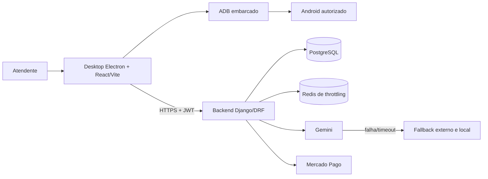
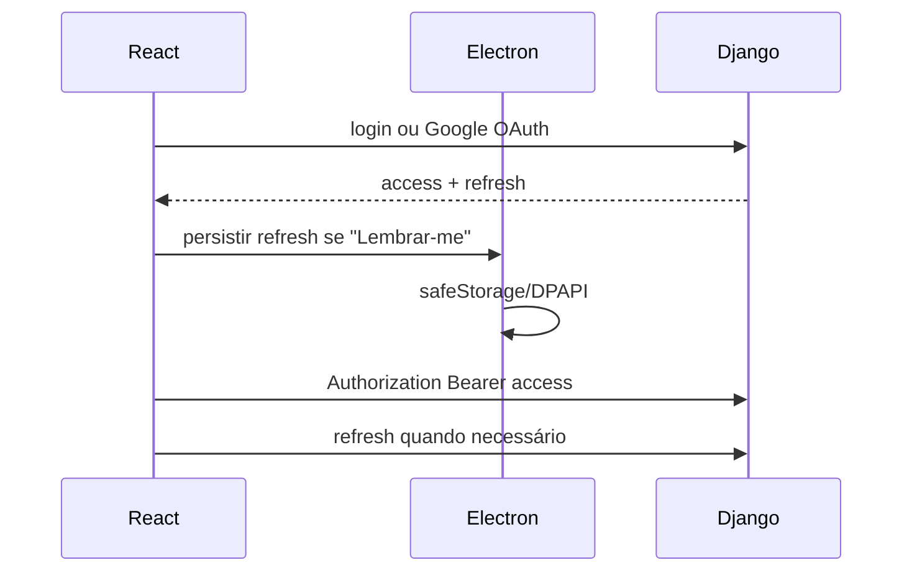

# Arquitetura

## Componentes

### Desktop

O Electron controla o ciclo de vida, a ponte segura do `preload`, o ADB embarcado e o armazenamento protegido de sessão. React/Vite implementa login, scanner, relatórios, dispositivos, suporte e visão gerencial.

O renderer não recebe secrets de integrações. Operações ADB passam por APIs permitidas no `preload` e pelo código do processo principal.

### Backend

Django REST Framework fornece autenticação, diagnósticos, clientes, relatórios, licenças, pagamentos, Diag IA, Google OAuth, recuperação de senha e tickets. O proprietário de registros autenticados é derivado de `request.user`.

### Produção

O backend roda com Gunicorn no Render, PostgreSQL e cache Redis compartilhado para throttling. `collectstatic` e `migrate` fazem parte do build do serviço.

### Autenticação e sessão

O access token permanece em memória. O refresh persistente usa `safeStorage` quando disponível; sessões antigas em `localStorage` são migradas e removidas.

### Diag IA

O desktop envia contexto técnico sanitizado ao backend. O backend tenta o modelo principal configurado, pode tentar novamente, usa o modelo alternativo quando cabível e só então devolve fallback local seguro.

## Limites de confiança

- o desktop não é fonte de verdade para usuário, licença ou pagamento;
- o backend não executa ADB: a coleta acontece localmente;
- resultados técnicos refletem somente fontes acessíveis;
- logs e respostas públicas não devem expor tokens, chaves, URLs com credenciais ou conteúdo pessoal.
