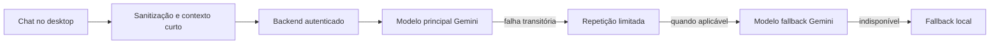

# Diag IA

## Objetivo

A Diag IA explica o uso do produto e interpreta contexto técnico permitido. Ela não substitui evidências, não executa comandos destrutivos e não deve solicitar senha, token, chave ou dado pessoal.

## Fluxo

O modelo principal e o fallback são configurados por `GEMINI_MODEL` e `GEMINI_FALLBACK_MODEL`. A chave `GEMINI_API_KEY` existe somente no backend. A documentação não presume quais modelos estão ativos no ambiente sem validação do deploy.

## Resiliência

No código atual:

- orçamento global do backend: 20 segundos;
- tentativa principal: até 10 segundos;
- fallback externo: até 6 segundos;
- máximo de duas tentativas no modelo principal quando o erro é transitório;
- timeout do cliente desktop: 25 segundos;
- fallback local ocorre depois das tentativas externas cabíveis.

## Contexto e privacidade

O payload inclui apenas contexto técnico sanitizado e limitado, como estado do aparelho, modo do scan, cobertura, módulos indisponíveis e contagens. Conteúdo de fotos, documentos, backups, credenciais e tokens não deve ser enviado.

Há memória curta de conversa, não uma memória irrestrita do usuário. Proteções detectam tentativas de prompt injection e removem chaves sensíveis do contexto.

## Suporte

A interface pode preparar um chamado sanitizado a partir da conversa e do contexto técnico. O ticket é persistido pelo backend; a Diag IA não envia e-mail por conta própria.

## Limitações

- respostas de IA podem falhar, atrasar ou exigir fallback;
- fallback local é orientativo e não simula resposta do provedor;
- a IA não deve declarar ameaça, causa ou correção que não seja sustentada pelos dados apresentados.
